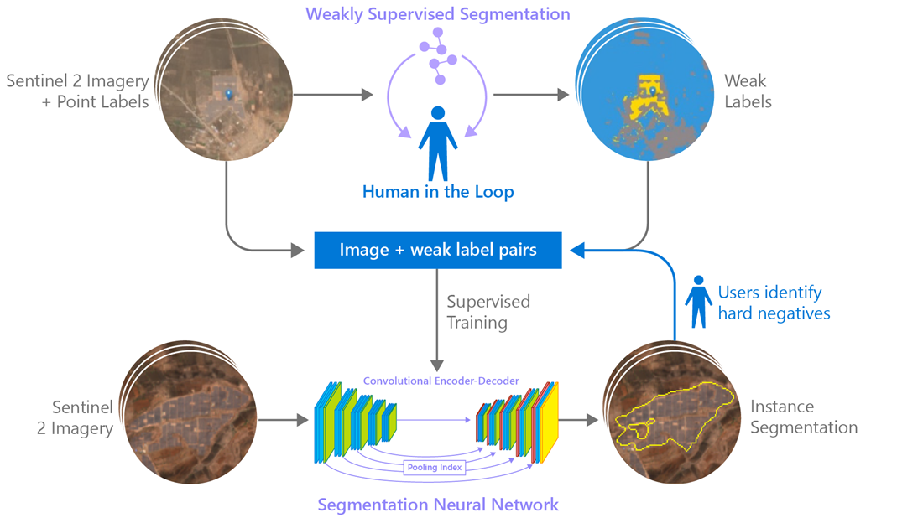
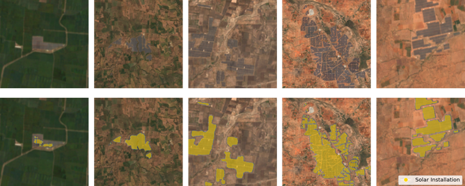

# An Artificial Intelligence Dataset for Solar Energy Locations in India

The majority of recent studies use either predictions of resource suitability or databases that are either developed thru crowdsourcing that often have significant sampling biases or have time lags between when projects are permitted and when location data becomes available. Here, we address this shortcoming by developing a spatially explicit machine learning model to map utility-scale solar projects across India using freely available satellite imagery. Model predictions were validated by human experts to obtain a total of 1363 solar PV farms. Using these outputs, we provide a cumulative measure of the solar footprint across India and quantified the degree of land modification associated with land cover types that may cause conflicts.

<figure>
  
  <figcaption style="text-align: justify">  <b>Figure 1:</b>  Solar PV mapping pipeline. An unsupervised model is train using a human in the loop approach to cluster solar farms pixels together and obtain weak semantic labels. These labels paired with geo-located Sentinel 2 imagery is used to create a semantic segmentation dataset suitable to train a supervised segmentation neural network. False positive predictions obtained from performing inference in novel scenes are considered hard negative and are used to augment the training dataset. 
  </figcaption>
</figure>


If you make use of this implementation or dataset in your own project or want to refer to it in a scientific publication, **please consider referencing this GitHub repository and citing our [paper](https://arxiv.org/abs/2202.01340)**:
```
@article{ortiz2022Solar,
  title   = {An Artificial Intelligence Dataset for Solar Energy Locations in India},
  author  = {Anthony Ortiz and Dhaval Negandhi and Sagar R Mysorekar and Shivaprakash K Nagaraju and Joseph Kiesecker  and Caleb Robinson and Aditi Khurana and Felipe Oviedo and Juan M. Lavista Ferres},
  journal = {arXiv preprint arXiv:2202.01340},
  year    = {2022},
}
```

<figure>
  
  <figcaption style="text-align: justify">  <b>Figure 2:</b>  Examples of solar farms predictions from our model for different areas in India. 
  </figcaption>
</figure>


# Dataset
Our solar farm dataset is available in this repo under the data folder. The file "solar_farms_india_2021.geojson" includes the raw geometries for individual polygons. The file "solar_farms_india_2021_merged.geojson" contains the individual oplygons cluster into solar pv farms based on proximity. The file "solar_farms_india_2021_merged_simplified.geojson" simplifies the geometry of the solar farms for easier use.

The dataset includes the following variables:

*	fid: Unique identifier for a solar farm. It is shared by polygons belonging to the same farm.
*	Area: The area of the site in squared meters (m2).
*	Latitude: Latitude corresponding to the center point of the solar installation.
*	Longitude: Longitude corresponding to the center point of the solar installation.
*	State: Indian State where the solar PV installation is located at.

## License for Dataset

Copyright (c) Microsoft Corporation. All rights reserved.

The dataset is open for anyone to use under the [CDLA-Permissive-2.0](https://spdx.org/licenses/CDLA-Permissive-2.0.html) license.

# Project setup instructions

* Open a terminal on the machine
* Install conda (note: if you are using a DSVM on Azure then you can skip this step as conda is preinstalled!)
## Install Anaconda
```
cd ~
wget https://repo.anaconda.com/archive/Anaconda3-2019.07-Linux-x86_64.sh
bash Anaconda3-2019.07-Linux-x86_64.sh # select "yes" for setting up conda init
rm Anaconda3-2019.07-Linux-x86_64.sh

## logout and log back in
exit
```

* Install NVIDIA drivers if you intend on using GPUs; note this might require a reboot (note: again, if you are using a DSVM on a Azure GPU VM then this is also handled)
* Setup the repository and install the demo data

```
# Get the project and demo project data
git clone https://github.com/microsoft/solar-farms-mapping.git

# install the conda environment
# Note: if using a DSVM on Azure, as of 7/6/2020 you need to first run `sudo chown -R $USER /anaconda/`
# make sure conda-forge and pytorch are in the conda channel

conda config --append channels pytorch
conda config --append channels conda-forge

# create precise solar farms environment
cd solar-farms-mapping
conda env create --file environment_precise.yaml
cd ..
```

## Summary Software Dependencies
🐍 Python 3.x
* torch==1.4.0
* torchvision==0.5.0
* tifffile==2020.2.16
* pyarrow==0.16.0
* imutils==0.5.3
* scikit-image==0.16.2
* scikit-learn==0.22.2
* tqdm==4.46.1
* imageio=2.9.0
* matplotlib==3.2.2
* shapely
* scipy>=1.6.0
* fiona
* geopandas==0.9.0
* opencv-python==4.5.1.48
* pillow==8.1.2
* rasterio==1.2.0
* seaborn==0.11.1


## Install Dependencies with Conda 

```bash
conda create --name solar python=3.X
conda activate solar
conda install pytorch torchvision cudatoolkit=XX.X -c pytorch
```

install dependencis from previous list

Note: Make sure to intall a version of cudatoolkit supported by your NVCC version. Our code was tested with Python 3.6 and cudatoolkit 11.0

# Training and doing inference

## Download Solar Farms Pretrained Model

You can download a pretrained solar farm model in the following link:

* [Solar Farm Model](https://researchlabwuopendata.blob.core.windows.net/solar-farms/checkpoint.pth.tar)

Note: Before running the example notebooks place the ``checkpoint.pth.tar`` file in the following directory:
``data/models/unet_hnm/``

## Training Solar Farm Segmentation Model

To train the network with default values and see training output on the command line run:

``python3 train.py --data_dir=/dir_to_datasets_directory/ --verbose``

Note: For training customized model check options available in the options directory

## Inference
Use the "tile_inference.py" script to do inference on image tiles. "inference_large_scale.py" lets you do inference for a list of tiles. Explore the demos uner the notebooks directory for inference examples.

# Demo Notebooks

We include two jupyter notebook demos under the notebooks directory. Feel free to explore it to get familiar with the code base. The "Inference Demo" give you examples of using one of our models to preddict solar farms from Sentinel 2 Imagery. The "Built Date Estimation and LULC study Demo" lets you get temporal S2 imagery from the Microsoft' planetary computer matching Solar Farms geometries, estimate when the solar farms were built and find the land covel/ land use classes that where substitute by solar farms.

# Web Visualizer

Visist our [web visualizer](http://msrcalebubuntu.eastus.cloudapp.azure.com/solar_farms.html) to interact with our data and visualize the simplified version of the dataset and download the data interactively. 

# Contribute
You can contribute to the project by submitting bugs and feature requests. 

# License for Code

Copyright (c) Microsoft Corporation. All rights reserved.

Licensed under the MIT license.

