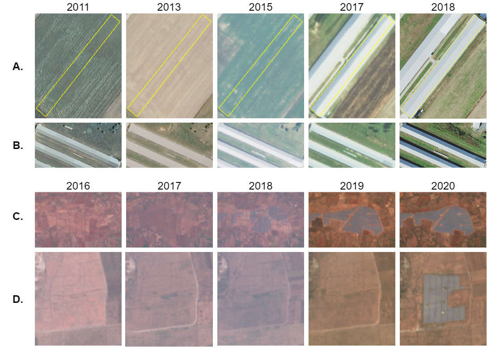

# Temporal Cluster Matching for Change Detection of Structures from Satellite Imagery

**Jump to: [Setup](#setup) | [Overview of the implementation](#overview-of-the-implementation) | [Running experiments](#running-experiments) | [Results](#results) | [Data sources](#data-sources)**

This repo contains an implementation of the Temporal Cluster Matching (TCM) algorithm and several baselines from the paper ["Temporal Cluster Matching for Change Detection of Structures from Satellite Imagery"](https://arxiv.org/abs/2103.09787). The Temporal Cluster Matching algorithm attempts to determine when a structure was constructed given that structure's footprint at a known point in time, as well as a time series of remotely sensed imagery leading up to that point in time. In the accompanying paper we use this algorithm with a dataset of _poultry barn footprints_ from the Delmarva Peninsula in the US and dataset of _solar farms footprints_ over the Indian state of Karnataka.

For a quick overview of the functionality implemented in this repo, see [notebooks/Basic library function demos.ipynb](notebooks/Basic%20library%20function%20demos.ipynb).

If you make use of this implementation in your own project or want to refer to it in a scientific publication, **please consider referencing this GitHub repository and citing our [paper](https://arxiv.org/pdf/2103.09787.pdf)**:
```
@inproceedings{robinsonTemporal2021,
  author  = {Caleb Robinson and Anthony Ortiz and Juan M. Lavista Ferres and Brandon Anderson and Daniel E. Ho},
  title   = {Temporal Cluster Matching for Change Detection of Structures from Satellite Imagery},
  year    = {2021},
  booktitle={Proceedings of the 4th ACM SIGCAS Conference on Computing and Sustainable Societies},
}
```


## Changelog

- **7/30/2021**
  - Added a dataloader for Sentinel 2 imagery based on the [Planetary Computer](https://planetarycomputer.microsoft.com/)
  - Added notebook demonstrating the new dataloader
  - Fixed bug in `algorithms.calculate_change_values` (if there were empty clusters then KL divergence value could be 'inf')


## Example figure

(A and B) Examples of two poultry barn footprints over 5 years of NAIP imagery. We observe inter-year variability of NAIP imagery and the change in the relation of color/texture between the footprint and neighborhood when a footprint is "developed". (C and D) Examples of two solar farm footprints over 5 years of Sentinel 2 imagery. Note, in A we outline the building footprint location in yellow through the entire series of imagery, but omit this outline in remaining rows.

<p align="center">
    
</p>


## Setup

First, run the following commands to create a conda environment, `tcm`, with the necessary dependencies for running the scripts and notebooks in this repository.
```
conda env create -f environment.yml
conda activate tcm
```

Then, download the `Delmarva_PL_House_Final.zip` file from the Soroka and Duren 2020 *Poultry barn* dataset from [here](https://www.sciencebase.gov/catalog/item/5e0a3fcde4b0b207aa0d794e). From the unzipped directory run:
```
conda activate tcm
ogr2ogr -of GeoJSON -t_srs epsg:4326 Delmarva_PL_House_Final2_epsg4326.geojson Delmarva_PL_House_Final2.shp
ogr2ogr -of GeoJSON -t_srs epsg:26918 Delmarva_PL_House_Final2_epsg26918.geojson Delmarva_PL_House_Final2.shp
```

Finally, copy the two generated files, `Delmarva_PL_House_Final2_epsg4326.geojson` and `Delmarva_PL_House_Final2_epsg26918.geojson`, to the `data/` directory in this repository.


## Overview of the implementation

Our implementation of TCM is broken up into a [data loader implementation](temporal_cluster_matching/DataInterface.py) and the [main algorithm implementation](temporal_cluster_matching/algorithms.py).
For each dataset that we would like to run our algorithm on, we must implement a data loader class following the interface defined in the `AbstractDataLoader`. This class is repsonsible for interfacing with the remotely sensed imagery (i.e. grabbing patches of imagery over time around arbitrary footprints).
For example, we have implemented a `NAIPDataLoader` that can load a series of patches of NAIP imagery over time given an input geometry.
With this, the [main algorithm implementation](temporal_cluster_matching/algorithms.py) can be agnostic of the dataset we want to use.
The main algorithm implementation, i.e. the `temporal_cluster_matching.algorithms.calculate_change_values(...)` method, will return a list of KL-divergence values for a single footprint / series of imagery patches, then it is up to the user to use these in a decision function. In the paper we describe the main TCM algorithm with a decision threshold value (theta), as well as baselines that use the KL-divergence values in a logistic regression model. For an example of how these two parts of the implementation fit together, see [notebooks/Basic library function demos.ipynb](notebooks/Basic library function demos.ipynb).

The `run_algorithm.py` script is used to run the main algorithm implementation over a set of footprints with a given dataloader. For examples of this see the next section on [running experiments](#running-experiments).


## Running experiments

To reproduce the main experiments we have included in the paper, first generate the KL-divergence values over the footprints for each dataset (as well over random polygons sampled from the respective AOIs):
```
python experiments/run_parameter_sweep_color.py # note, this will take a long time
python experiments/run_parameter_sweep.py # note, this will take even longer
```

As these take a long time to run, we have included the results of these runs in the repository already (see `results/`). You can reproduce a single run as:
```
python run_algorithm.py --dataset poultry_barns --num_clusters 32 --buffer 400 --output_dir results/kl/poultry_barns-32-400/ --algorithm kl
```

The second step is to generate predictions on when each footprint was constructed. See the following notebooks for examples that do this:
- `notebooks/Experiments - Learned theta and LR methods.ipynb`
- `notebooks/Experiments - Heuristic method.ipynb`


## Results

As mentioned in the previous section, we have included the results that we generated for the paper. The following is a list of the files containing these results and a brief description of how they were generated / what they contain:
- `results/poultry_barn_inter_year_color_distances.npy`
  - Generated by `notebooks/Experiment - Color over time.ipynb`.
  - This contains the differences in average footprint color between consecutive dates for each footprint in the poultry barn dataset.
- `results/solar_farm_inter_year_color_distances.npy`
  - Generated by `notebooks/Experiment - Color over time.ipynb`.
  - This contains the differences in average footprint color between consecutive dates for each footprint in the solar farm dataset.
- `results/heuristic-theta_results.csv`
  - Generated by `notebooks/Experiments - Heuristic method.ipynb`
  - This contains the Bhattacharyya coefficient, accuracy, and MAE results for each combination of {dataset, buffer, number of clusters} that we experiment with.
- `results/learned-theta_lr_results.csv`
  - Generated by `notebooks/Experiments - Learned theta and LR methods.ipynb`
  - This contains the accuracy and MAE results for each combination of {dataset, buffer, number of clusters} that we experiment with.
- `results/kl/*`
  - Generated by `experiments/run_parameter_sweep.py`
  - These are the raw output (i.e. list of KL divergences) for each combination of {dataset, buffer, number of clusters} that we experiment with using the TCM algorithm.
- `results/color/*`
  - Generated by `experiments/run_parameter_sweep_color.py`
  - These are the raw output (i.e. list of Euclidean distances) for each combination of {dataset, buffer, number of clusters} that we experiment with using the "Average-color" baseline.


## Data sources

This project uses two datasets, **Poultry barns** and **Solar farms**:
- The **Poultry barns** dataset is a [public dataset from the USGS](https://www.sciencebase.gov/catalog/item/5e0a3fcde4b0b207aa0d794e). See the following citation:
  - Soroka, A.M., and Duren, Z., 2020, Poultry feeding operations on the Delaware, Maryland, and Virginia Peninsula from 2016 to 2017: U.S. Geological Survey data release, https://doi.org/10.5066/P9MO25Z7.
- The **Solar farms** dataset is a collection of model detected solar farms (polygons) over the Indian state of Karnataka, included as `data/karnataka_predictions_polygons_validated_2020.geojson`.

The `data/delmarva_valid_naip_area.geojson` and `data/solar_farms_valid_s2_area.geojson` files give the spatial extent of these datasets. The `data/naip_tiles_that_intersect_with_delmarva.txt` file contains a list of NAIP tiles (with respect to the [Azure Open Dataset NAIP catalog](https://azure.microsoft.com/en-us/services/open-datasets/catalog/naip/)) that intersect with the spatial extent of the **Poultry barns**. The `temporal_cluster_matching/DataInterface.py` file contains methods for interfacing with the NAIP and Sentinel 2 imagery we use in each dataset. Finally, our manual construction date labels for these two datasets can be found in `data/poultry_barn_labels.csv` and `data/solar_farm_labels.csv`.


The `data/poultry_barn_6013_random_polygons_epsg26918.geojson` and `data/solar_farms_935_random_polygons_epsg4326.geojson` files contain the random selection of polygons over the two datasets used in our proposed heuristic method. These were generated by `notebooks/Data - Create random polygons.ipynb`.


# License

This project is licensed under the [MIT License](LICENSE).
